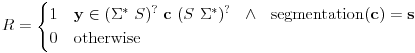
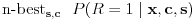
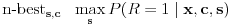

# kaldi-lattice-word-index

This tool builds a word index from character lattices.

Build a word index from character lattices.

Words are any sequence of characters in between any of the separator symbols
(e.g.: whitespace, punctuation marks, etc).

The program will output the n-best character segmentations of words, with their
scores. More precisely:

Let's define a binary variable R that denotes whether the character transcript
(**y**) of the sample (**x**) contains the word formed by the sequence of 
characters **c**, where each character is segmented according to the sequence **s**.



Then, the program computes:

- If ```--only-best-segmentation=false``` (the default) then:



- If ```--only-best-segmentation=true``` then:




In any case, the score for a character sequence (**c**) is a lower bound to
P(R = 1 | **x**, **c**), but it is usually quite close.

## Usage
```
Usage: kaldi-lattice-word-index [options] separator-symbols lat-rspecifier
 e.g.: kaldi-lattice-word-index "1 2" ark:lats.ark
 e.g.: kaldi-lattice-word-index --nbest=10000 "1 2" ark:lats.ark
`````

## Options
  - --acoustic-scale            : Scaling factor for acoustic likelihoods in the lattices. (float, default = 1)
  - --beam                      : Pruning beam (applied after acoustic scaling and adding the insertion penalty). (float, default = inf)
  - --delta                     : Tolerance used in determinization. (float, default = 0.000976562)
  - --graph-scale               : Scaling factor for graph probabilities in the lattices. (float, default = 1)
  - --insertion-penalty         : Add this penalty to the lattice arcs with non-epsilon output label (typically, equivalent to word insertion penalty). (float, default = 0)
  - --max-mem                   : Maximum approximate memory usage in determinization (real usage might be many times this). (int, default = 536870912)
  - --nbest                     : Extract this number of n-best hypothesis. (int, default = 100)
  - --only-best-segmentation    : If true, output the best character segmentation for each word. (bool, default = false)
  - --symbols-table             : Use this symbols table to map from labels to characters. (string, default = "")
