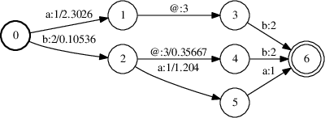
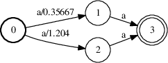

# Example for kaldi-lattice-word-index

Suppose that we have a some character lattice from which we wish to generate
a word-based index (see `lattice.txt`):

```
lat1
0	1	1	2.30259,0.0,1_1_1
0	2	2       0.10536,0.0,2_2
1	3	3	0.0,0.0,3_3
2	4	3       0.35667,0.0,3_3_3
2	5	1	1.20397,0.0,1_1
3	6	2	0.0,0.0,2_2_2_2
4	6	2	0.0,0.0,2_2_2_2
5	6	1	0.0,0.0,1_1_1_1_1
6	0.0,0.0,
```

The previous lattice can be represented (ignoring the character segmentation)
by the following FST:



Assuming that the separator symbol is *@* (label id = 3, see `syms.txt`),
in order to produce the index of "words" from the lattice, just type:

```bash
$ ../kaldi-lattice-word-index --symbols-table=syms.txt 3 ark:lattice.txt
```

And the program will produce the following output:

```
lat1 -0.314711 b 5 9
lat1 -0.462034 b 0 2
lat1 -1.30933 b a a 0 2 4 9
lat1 -2.30259 a 0 3
```

How do we interpret this output? Line by line:

1. The word **b** is in between frames 5 and 9, with a log-probability of
-0.314711 (i.e 0.73).

2. There is also another **b** word in that line, between the frames 0 and 2
with log-probability -0.462034 (i.e. 0.63).

3. The word **b a a** is within the frames 0 and 9 (where each individual
character of the word is within the frames b: 0-2, a: 2-4, a: 4-9), with
log-probability -1.30933 (i.e. 0.27).

4. The word **a** is within the frames 0 and 3 with log-probability -2.30259
(i.e. 0.1).

As you can see, the same word can appear multiple times in the output file,
considering different character segmentations of the word. If you want to
retain only the best occurrence of a word within the line, use
`--only-best-segmentation=true`. In this case, you would get:

```
lat1 -0.314711 b 5 9
lat1 -1.30947 b a a 0 2 4 9
lat1 -2.30259 a 0 3
```

## Word-level segmentation instead of character-level segmentation scores

Notice that the program computes _P(R = 1 | **x**, **c**, **s**)_ for each
of the n-best word and character segmentations. However, the same word
can have the same word-level segmentation but multiple character-level
segmentation hypotheses.

If you want to compute something like _P(R = 1 | **x**, **c**, z)_, where 
_z_ is know the word-level segmentation, you will need to approximate this
calculation (although in many cases you will get the exact score) as a 
post-process step:

Take for instance, the lattice represented in `lattice2.txt`:

```
lat2
0	1	1	0.3566749,0.0,1_1_1
0	2	1	1.2039728,0.0,1_1
1	3	1	0.0,0.0,1_1
2	3	1	0.0,0.0,1_1_1
3	0.0,0.0,
```

Omitting the character segmentation info, the lattice is represented by the
following FST:



This lattice has two paths with the same character sequence (i.e. **a a**),
but with different character-level segmentation hypotheses.

After executing the program:

```bash
../kaldi-lattice-word-index --symbols-table=syms.txt 3 ark:lattice2.txt
```

You get:

```
lat2 -0.356675 a a 0 3 5
lat2 -1.20397 a a 0 2 5
```

Again, notice that the character-level segmentation of the word **a a** is 
different, but the whole word-level segmentation is the same in both cases 
(word is between frames 0 and 5). So, you just need to add these scores 
(in the log-semiring).

After executing the `run.sh` script, you will get:

```
# WORD-LEVEL SEGMENTATION INDEX:
lat2 8.02056e-07 a a 0 5
```

Notice that this is just an approximation: in order to get the real value 
(and the real word-level best segmentations), you would need to do this
summation *before* extracting the n-best list. But this is not currently 
possible.
